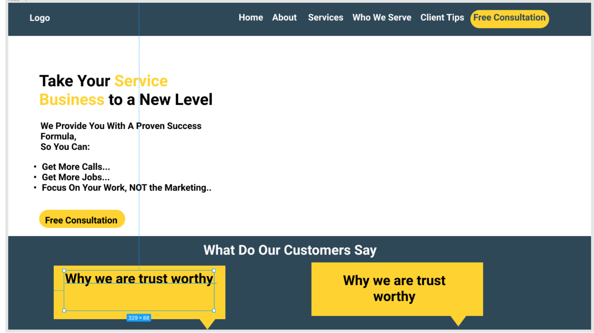
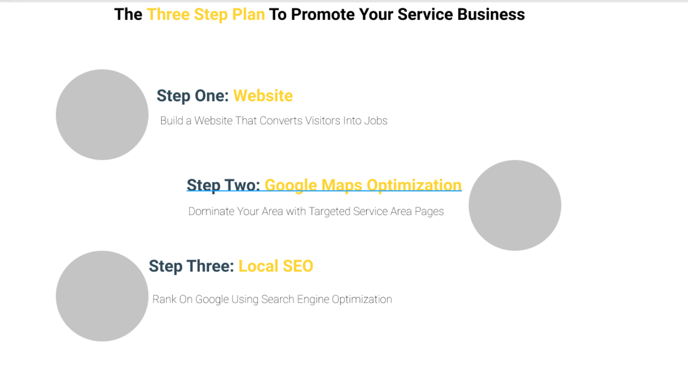
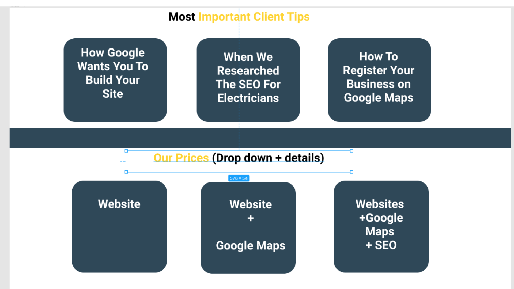
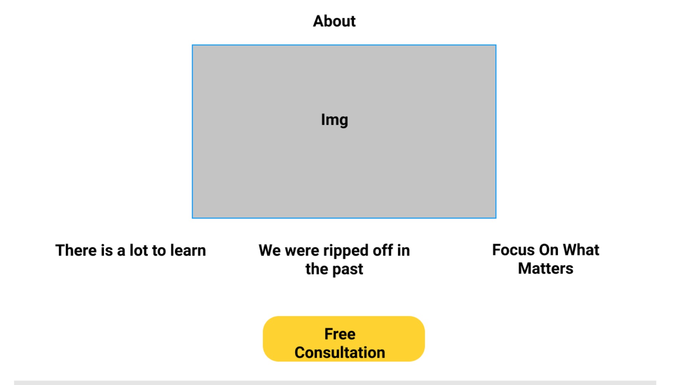
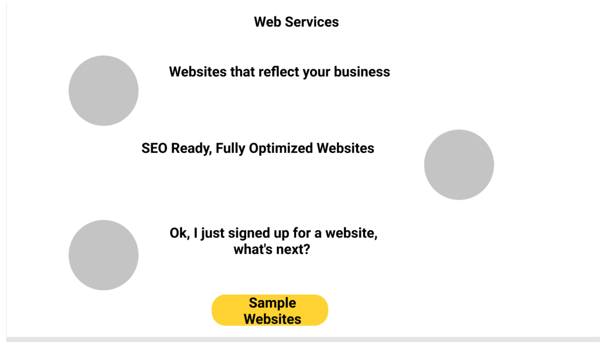
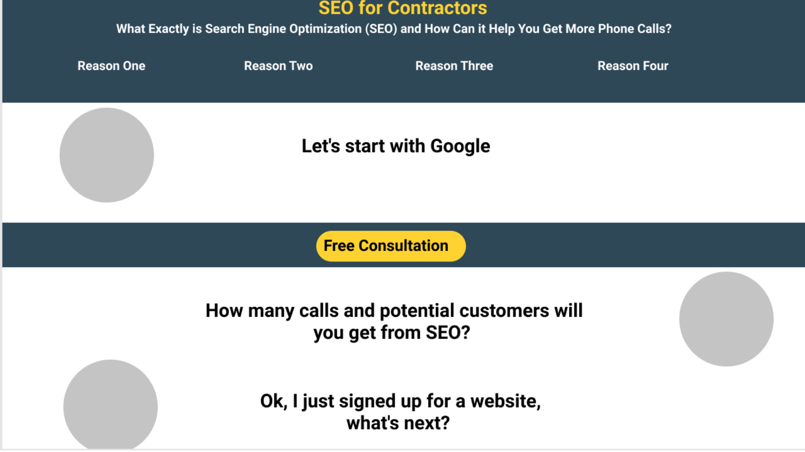
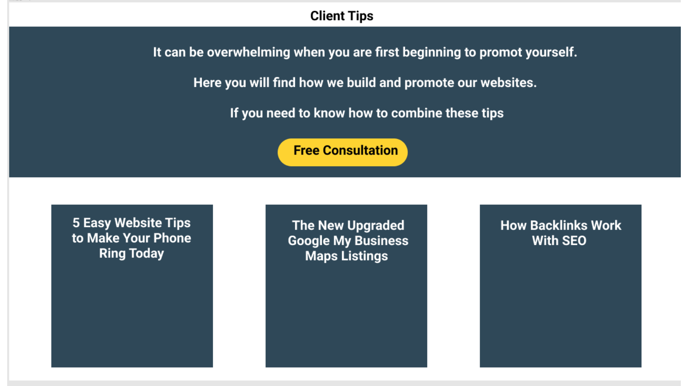
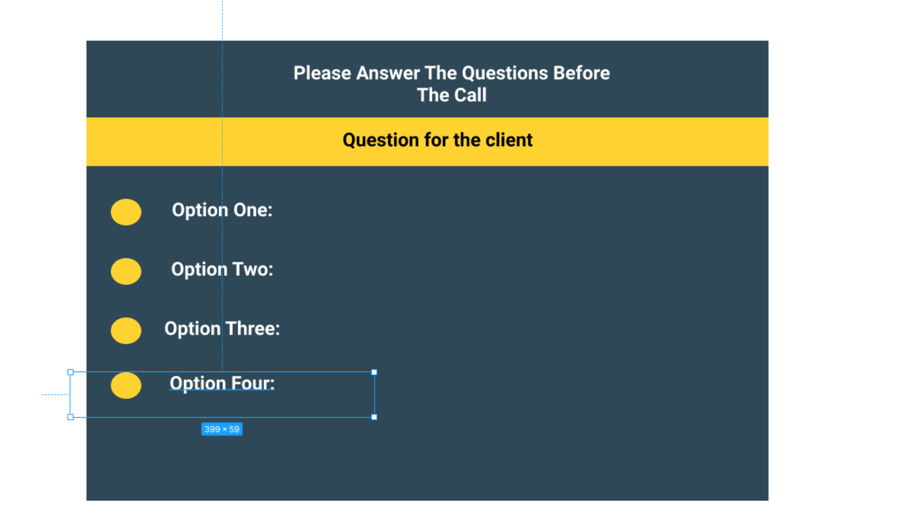

# Tradesman Marketing

## Intro

This is a comprehensive website was designed for a web development and marketing company that targets a self employed tradesmen.
The purpose of the website was to .
- Develop trust beween potential customers and the company 
- Automatically Segment different types of tradesmen into different target goups
- Show the users where we opperate around the country 
- Quiz the customers on how much experience they have in their respected field

This is the first of four Milestone Projects that the developer must complete during their Full Stack Web Development Program at The Code Institute.

The main requirements were to make a responsive and static website with a minimum of three pages using primarily HTML5 and CSS3 with the functionality being created with javascript. 

# UX

## Ideal User Demographic
The ideal user of this website is:
- Self employed Tradesman
- More than 18 months experience in their chosen field 
- Gets a lot of recommendation work from previous customers 
- Has the budget to work on their own social meida marketing  
- Is capable of adding photos and descriptions to a wordpress website

## New/Potential Fans Goals:
As a new user, I want to easily navigate through the website to find the relevant content, effortlessly.

As a new user, I want to learn more about the companies's background in order to better understand how they build and promote websites. 

As a new user, I want to easily understand exactly how the company creates backlinks and builds an online presence. 

As a new user, I want to be able to book a consultation call with the company to discuss my ideas about how to promote my business online.

As a new user, I want to be able to watch an embedded video to be able to learn information quickly. 

As a new user, I want to identify which content is relevant to me. 

## Current Customer Goals:

As a current customer, I want to understand what the company is doing behind the scenes and he logic of why they are doing this. 

As a current customer, I to continually develop my understanding of promoting my business in my chosen niche. 

# Development Planes
In order to create a comprehensive and informative website, the developer worked closely with several self employed traders to distinguish the required functionality of the site and how it would answer the user stories, as described above.

## Strategy
Broken into three categories, the website will focus on the following target audiences:

## Roles:
- Plumbers 
- Electricians 
- Carpet Ceaners
- Landscapers 
- Handymen 

## Information:
- Information on relevant web design for tradesmen 
- Information on how to develop the local SEO and its relevance 
- Information on onlline marketings best practices for tradesmen 

## Consultations 
- How long the user has been in his industry for 
- Level of tech expertease 
- Willingness to learn and develop social media marketing skills

## Case Studies 
As a way to develop more comprehensive reviews and content (and recommendation work) I would like to develop several case studies around the chosen target audience. However due to the time frames of this project I would not be able to create them at this time. 

# Scope
A scope was defined in order to clearly identify what needed to be done in order to align features with the strategy previously defined. This was broken into two categories:

## Content Requirements
The user will be looking for:
Instruction for web development 
Social media tips 
SEO Ranking tips 
How To Convert customers 

## Functionality Requirements
The user will be able to:
Easily navigate through the site in order to find the information they want
Be able to find links to external sites in order to:
Book a consultation 
Find the areas we work in 
Contact us directly with any further questions

# Structure 

The structure of of the site was based on the website from [Big West Marketing] (https://bigwestmarketing.com/)

The original concept  design was done using canva.

These designs would be used and reused when appropriate around the site. 

Home Page banner

Home page steps 

Home page tips and prices

Home page FAQ

About page intro

Web services page 

SEO service for contractors page 

blog page 

quiz before consultation 

# Scope
A scope was defined in order to clearly identify what needed to be done in order to align features with the strategy previously defined. This was broken into two categories:

# Design
## Colour Scheme
The main colours used throughout the website are used to drive attention and funnel the user to the consultation quiz. 

The chosen colour scheme therefore reflected as a contrast. Dark yellow and dark blue. 

## Imagery
The selected imagery is used to allow the users to quickly identify what the different content is used for (Web design, Google redg and SEO)

# Features

## Design Features
Each page of the website features a consistent responsive navigational system:

The header contains a concentionally placed logo in the top left of the page with a call to action for the free consultation on the left. The navigation links have a series of drop downs that subdivde the user by needs, ocupation and then skills. 

The footer is reponsive but keeps the same design and features, links to key pages and articles. 

The header is not sticky but there is a click to go back to the top that is there for mobile and desktop. 

## Home Page

The home page is divided into six sections.
- Banner 
- Steps 
- Reviews 
- Key articles 
- Prices 
- FAQ

## The banner 
Has a call to action for the consultation quiz. This is a plan background that allows the colors to guide the user to the key information and the call to action.

## Steps 
This section consists of three different sections each with a related image, title and description. This sections purpose is to allow the customer to understand the process of how we work. Building the website, registering on Google and then local SEO. Complete transparencey about how we work is key to build trust and develop the relationships further. 

## Key articles 
These pages are also found on the blog page, but we recommend users start here if they are thinking of promoting themselves online. This does several things, builds trust, gets the customer on the same page as us and allows for more productive conversations during the consultation. There articles cover the basics of web design for tradesmen and the benefits of running a local SEO campaign

## Reviews
The review section is a responsive section that has three five star reviews from different customers who have taken our survey. 

## Prices 
The prices section is interactive and the prices and features changes using a switch for monthly and quartarly prices. These packages are for only web development, web development and seo and a final package for web development and marketing. 

## FAQ 
The FAQ section is placed under the prices and features to answer common questions about the prices and features. This is done through a dropdown that has the most common questions and answers to why the pricing is set up like this. 

## About page 
The about pages purpose is to promote the free consultation. It does this by talking about the difficulties that tradesmen find when they start promoting themselves online and the benefits of getting feedback for what you want to do to start promoting yourself. It then has several of the key articles that we have under the consultation button, which are phrased as a question that user would have about a certain issue. This further supports the user wanting to contact us.

## Contact page 
The contact page's purpose is to allow users to contact us with any of there questions and also to show the users where we opperate around the contry. We have done this with a responsive form and a Google maps intergration where we have shown different location with different customers. 

These can be clicked on with more information popping up. 

I would have liked to put reviews in the map intergration, however this will be done in the future once we have these reviews to woek with. 

## Our methods 
This is our blog page and consists of articles related to working with Google, web design and local SEO for tradesmen. The top articles are the most valuable and we recommend our customers to start here with the title (start here). This gives them a good background to move forward into more detailed articles and allows us to commincate better with them during the conversation because they have this background. 

There is also a video introduction at the top of the blog page explaining the kind of content that we have and how they should be used.

## Articles 
The articles are layed out in the sae way. The sees a video on the top of the page giving a quick intro to the article and what the benefits are of reading the article. 

This will then be expanded on in the article with several call to action buttons to book the consultation. 

Further related articles will then be displayed at the bottom of the page to encourage reading related topics. 

## Web Services 
The web design services are split into several sections 
- video: video introduction of what is on the page and giving students instructions about what to do on the page 
- description: The benefits of using a website for your online presence 
- Web templates: Website templates that we have used in the past that customes can choose from and make the web design process smoother.
- how to work with us: This section describes if want us to do everything for them or work with them for as partners 
- prices: The prices monthly or quarterly 
- related articles: After the website what do they do next, these are articles that we recommend they read to understand the seo and marketing aspects 

## SEO Services 
This page as far more text than the web services page. 

The reason being is although many will understand what and why they need a website not many tradesmen will know about SEO and why they will need it. 

This page acts as both a white pager and a landing page for our seo services by educating the users about SEO then offering our prices and related articles. 

# Functions 

These were created with javascript and adds functionality to the site 

These can be found in the 

## Google maps Integration  
In the contact page the google api was intergrated and edited. Markers were added to the the page and the color was changed to match the theme of the website, this was to signify the places where we have created websites for customers. We also added a click function allowing students to click on the marker and open more information. 

In the future as I mentioned above I would like to put the reviews of customers into these clickable events, but with the time constraints on the project I could not accomplish this. 

## FAQ drop down 
This was a toggle function that allows the user to click the common question and the box is then toggled from hidden to display with a transition effect showing the answer to the question. 

## Prices and features
This was on the main area and is another toggle effect with sliding animation. This was only on certain parts of the element (the price and the features that changed). This was used to show the difference in price for monthly and quartarly packages. 

## video player 
The video player was built from scratch using javascript with increased functionality. 

The icons for the play pause and the volume icons will change depending on if the video is playing or if the volume is above 70% or at 0%. 

There is also a function to increase or decrease the speed of the video and a full screen option. 

## The quiz 
The quiz was used to set up the free consultation to allow us to narrow down which of our customers would be suitable. 

We were looking for customers who have more than 18 months experience who have some tech knowledge(enough to have a discussion). 

The questions and choices were dynamically added using the innerText in javascript to the relevant id's in the html. The questions and choices were all added in an array of objects with the answers added within the same array of objects as another array (this was done because some of the questions had more than one suitable answer)

When the user got one of the question correct their score would increase by 100, this would then be saved into local storage. 

Once the user was asked five questions they would then be taken to the ending page. This page would have a contact form where the user could contact us. 

There would also be a dynamic message to the user on the page depending on if they got above 300. 

We will still take the custom if they get below the 300 points, as this is a consultation but the user will now know that they need to conduct more research.

If I had more time for this project I would use node.js to send the information that was saved in local storage with the information the user puts into the storage to the businesses email.

## The Form validator 

The form validator used in the contact page and the the end page of the quiz were created to validate the user input based on the number and types of characters they entered. 

If I had more time for this project I would use node.js to send the information that was saved in local storage with the information the user puts into the storage to the businesses email.

# Issues and bugs 

features overlay 
array for quiz 

## Issue one the video player 

This issue was caused by two independent issues. 

- The first was I started to put all the javascript into a single js file, this caused any failure to crash all the script.
- The second was a small spelling mistake in the scripts tag in the blog page (the first page to text the videos)

This was solved firstly by creating different js files for different components. 

The second was traced to its source by using the console in the google dev tools. Since there was nothing showing up in the tools I thought that the mistakes would be in the html and using the controle f I found the mistake. 

## Issue the features mobile responsiveness 

The was something in the features that was causing the homepage to not be responsive past 500px. I could not find the issue even when changing the color of certain elements, 

I solved this by dowloading a developer tool called unicorn revieler 

