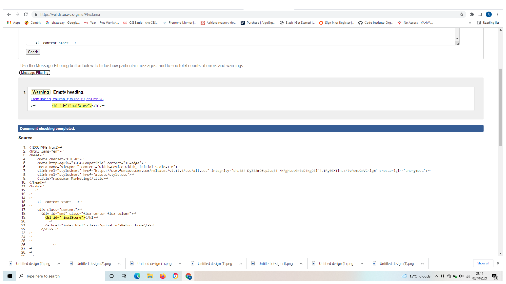

# Testing 

[Manual testing](#manual-testing)

[Manual testing](#validators)

[Browser Validation](#browser-validation)

[User testing](#user-testing)

## Testing User Stories

## New/Potential User Goals
As a new user, I want to easily navigate through the website to find the relevant content for my specific needs, effortlessly.

- The navigation bar is clearly defined and easily navigable for users to find and use.
- The drop down in the navigation menu easily allows the user to identify relevant content for themselves (their specific niche).
- The blog page has a start here section allowing the users to get a background education before going into more specific tips.
- The logo image on the top left of each page leads users back to the home page.
- The footer menu is easy to use with appropriate icons for easy identification.

- The 'About' page is appropriately named for identifying customers common frustrations with working online and offers suitable solutions. 
- Each articles has a related reading section which offers related content to the article.
- The consultation is easy to find on the top of the navbar and is promoted as a way to gain feedback about plans to promote a business online. 

- The social links are located in the footer on desktop and tablet devices.
- In each instance, each link is represented by an appropriate icon for easy identification of the social platform.

# Manual Testing 

Manual testing was done on the common elements that appeared on every page and the most important elements to the site. 

- Home page navigation drop down 

- Home Page Responsiveness 

- Home page prices toggle 

- Home page faq 

- Contact response 

- Contact page form validation 

- Contact page map icons 

- About Page Responsive

- Our methods video 

- Our methods responsive 

- Our key articles 

- web development responsive 

- SEO services responsive 

- Quiz with different message depending on if they get above 300 points

# Validators 

## CSS Validation 

The W3C Markup Validator service was used to validate the CSS code used.

## HTML validation 

About page html 

Article one html 

Article two html 

Article three html 

Article four html 

Article five html 

Article six html 

Article seven html 

Article eight html 

Article nine html 

Article ten html 

Blog html 

carpet cleaners html 

Contact html 

handyman html 

index html 

landscapers html 

Plumbers html 

SEO html 

quiz start html 

quiz questions html 

end html 

## Javascript 

The javascript was tested using the javascript beautifier. 

The back to top validator 

The ending of the quiz page 

The questions page 

The video page 

The map 

# Browser Validation

Chrome

Edge

Firefox

# User testing 

Several tradesmen were asked to view the site and give feedback, it was through this feedback that I settled on the current header design with the three drop downs as a way to direct users who have little to know experience with working online to the relevant materials. 

Before this there were more elements in the header but this lead to confusion because many of them had never heard of topics like seo, or had little idea about online marketing. 

