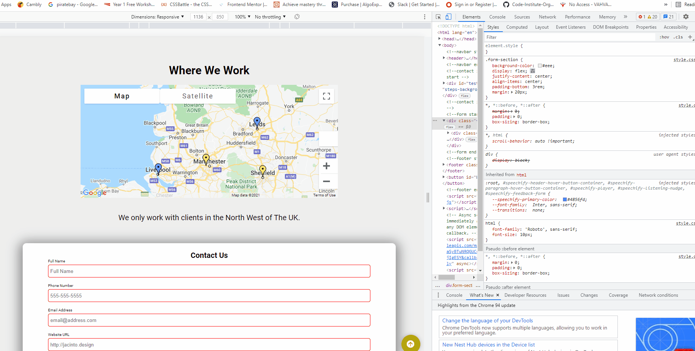
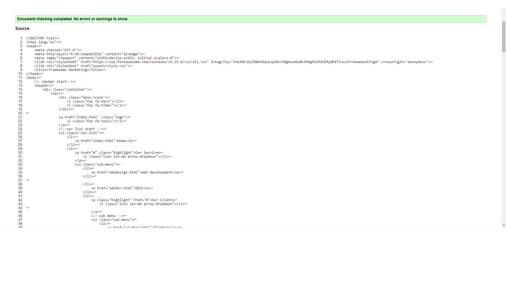

Home page 

the menu links hover on all pages 

the menu links to pages 

the mobile responsiveness of the navbar 

the responsiveness of the home page 

the css 

the html 

the javascript 

the about page 

The contact page 

The blog page 

the web services page 

the seo services page 

the quiz page/ end page 

# Testing 

## Testing User Stories

## New/Potential User Goals:
As a new user, I want to easily navigate through the website to find the relevant content for my specific needs, effortlessly.

- The navigation bar is clearly defined and easily navigable for users to find and use.
- The drop down in the navigation menu easily allows the user to identify relevant content for themselves (their specific niche).
- The blog page has a start here section allowing the users to get a background education before going into more specific tips.
- The logo image on the top left of each page leads users back to the home page.
- The footer menu is easy to use with appropriate icons for easy identification.

- The 'About' page is appropriately named for identifying customers common frustrations with working online and offers suitable solutions. 
- Each articles has a related reading section which offers related content to the article.
- The consultation is easy to find on the top of the navbar and is promoted as a way to gain feedback about plans to promote a business online. 

- The social links are located in the footer on desktop and tablet devices.
- In each instance, each link is represented by an appropriate icon for easy identification of the social platform.

# Manual Testing 

Manual testing was done on the common elements that appeared on every page and the most important elements to the site. 

- Home page navigation drop down 

- Home Page Responsiveness 

- Home page prices toggle 

- Home page faq 

- Contact response 

- Contact page form validation 

- Contact page map icons 

- About Page Responsive

- Our methods video 

- Our methods responsive 

- Our key articles 

- web development responsive 

- SEO services responsive 

- Quiz with different message depending on if they get above 300 points

# Validators (code Validation)

## CSS Validation 

The W3C Markup Validator service was used to validate the CSS code used.

## HTML validation 

About page html 

Article one html 

Article two html 

Article three html 

Article four html 

Article five html 

Article six html 

Article seven html 

Article eight html 

Article nine html 

Article ten html 

Line	Col	Errors
71	14	'arrow function syntax (=>)' is only available in ES6 (use 'esversion: 6').
74	27	'spread operator' is only available in ES6 (use 'esversion: 6').
78	19	'arrow function syntax (=>)' is only available in ES6 (use 'esversion: 6').
87	30	'template literal syntax' is only available in ES6 (use 'esversion: 6').
89	35	'template literal syntax' is only available in ES6 (use 'esversion: 6').
102	28	'arrow function syntax (=>)' is only available in ES6 (use 'esversion: 6').
103	38	['number'] is better written in dot notation.
113	24	'arrow function syntax (=>)' is only available in ES6 (use 'esversion: 6').
114	40	'arrow function syntax (=>)' is only available in ES6 (use 'esversion: 6').
119	61	['number'] is better written in dot notation.
133	21	'arrow function syntax (=>)' is only available in ES6 (use 'esversion: 6').
141	22	'arrow function syntax (=>)' is only available in ES6 (use 'esversion: 6').
71	1	'startGame' is not defined.
146	1	'startGame' is not defined.
75	5	'getNewQuestion' is not defined.
78	1	'getNewQuestion' is not defined.
135	13	'getNewQuestion' is not defined.
128	13	'incrementScore' is not defined.
141	1	'incrementScore' is not defined.

home page 

response 

prices 

faq 

jump to top

navbar 

contact page 

map 

form 

about 

methods 

video player 

articles x 3 

website services 

website templates 

seo services 

quiz more than 300

quiz less than 300 

multiple answers 

form 

